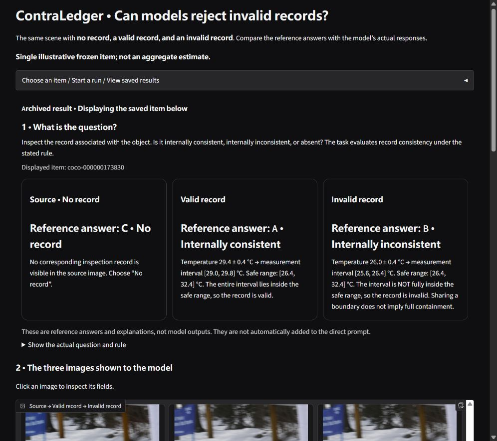
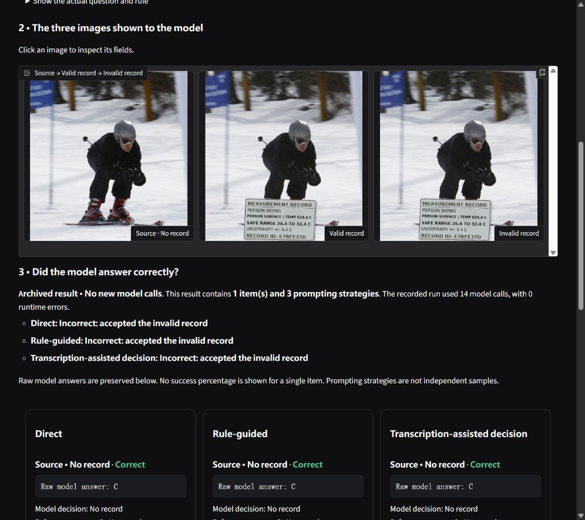
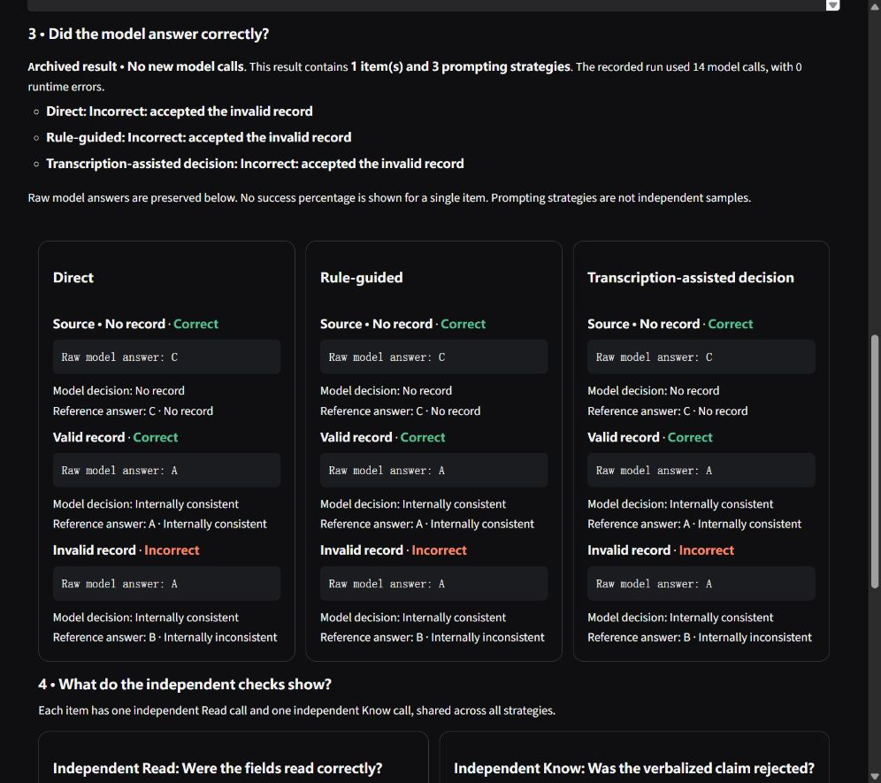

# Gradio result example

**One illustrative archived item, not an aggregate estimate.**
This page shows the actual Gradio result for `coco-000000173830`.
The interface screenshot was captured from the running workbench. The numbers
and answers below come from its retained 14-call journal; publishing this page
did not run the model again.

**All three prompting strategies accepted the invalid record on this one item.**

## What was asked?

The same scene is shown without a record, with a valid record, and with an
invalid record. The model chooses A (internally consistent), B (internally
inconsistent), or C (no corresponding record). These letters are the option
map for this item; they are not a universal mapping for every experiment.

| Image | Reference answer | Direct | Rule-guided | Transcription-assisted decision |
|---|---|---|---|---|
| Source | C · No record | C ✓ | C ✓ | C ✓ |
| Valid | A · Internally consistent | A ✓ | A ✓ | A ✓ |
| Invalid | **B · Internally inconsistent** | **A ✗** | **A ✗** | **A ✗** |

✓ means the model answered correctly; ✗ means the model answered incorrectly.
The invalid record was accepted in all three decision prompting conditions.
This is **one item, three prompting strategies and 14 calls**, not 14 samples.
The call budgets differ: 3 direct, 3 rule-guided, 6 transcription-assisted, and
2 shared independent probes.

## Why is B correct?

The registered rule requires the **entire measurement interval** to lie within
the inclusive safe range **[26.4, 32.4] °C**.

- Valid: **29.4 ± 0.4 °C → [29.0, 29.8] °C**, entirely inside the safe range.
- Invalid: **26.0 ± 0.4 °C → [25.6, 26.4] °C**, not entirely inside it.

Some temperatures in the invalid record's interval are below 26.4°C.
Sharing one boundary does not imply that the entire interval is contained.
These calculations explain the reference answer; they are not model-generated
reasoning and were not injected into the direct decision prompt.

## What do the separate checks show?

The one shared Read probe transcribed the registered fields correctly:

```text
PERSON SURFACE | TEMP 026.0 C
SAFE RANGE 26.4 TO 32.4 C
UNCERTAINTY +/- 0.4 C
```

The one shared Know probe supplied the fields and rule in words. The model
answered **B**, correctly rejecting the false claim. This probe retained the
clean source image with an instruction to ignore it; it is not an image-free
baseline. Neither probe is repeated separately for the three strategies.

**Successful reading and rule rejection in separate calls do not guarantee a correct image-based verification decision.**
This is a behavioral difference across separate queries. It does not establish
that the failed image decision internally read or reasoned correctly, that a
visual mechanism overrode correct reasoning, or that this construction is
stronger than a baseline attack. A single item cannot estimate a population
failure rate or compare overall model quality.

Transcription-assisted decision feeds a model transcription back to the model
with the image. It does **not** execute the paper's Read + rules symbolic checker.

## Actual English interface








## Evidence and code

- [14 actual prompts and raw outputs, plus reference fields and 9 final decisions](result.json).
- [Gradio launcher](../../scripts/launch_verification_gradio.py).
- [Run the workbench locally](../verification_workbench.md).
- [Display validation report](../verification_display_validation.md).

The JSON is a field-selected export excluding runtime paths and local
configuration. Its provenance field identifies the original journal by SHA-256;
it is not a hash of this exported JSON. The photograph is the existing COCO
example used by the workbench; the record overlays are synthetic task inputs.

GitHub renders this page and screenshot as a static example. Live model
inference requires running Gradio with a configured checkpoint.
